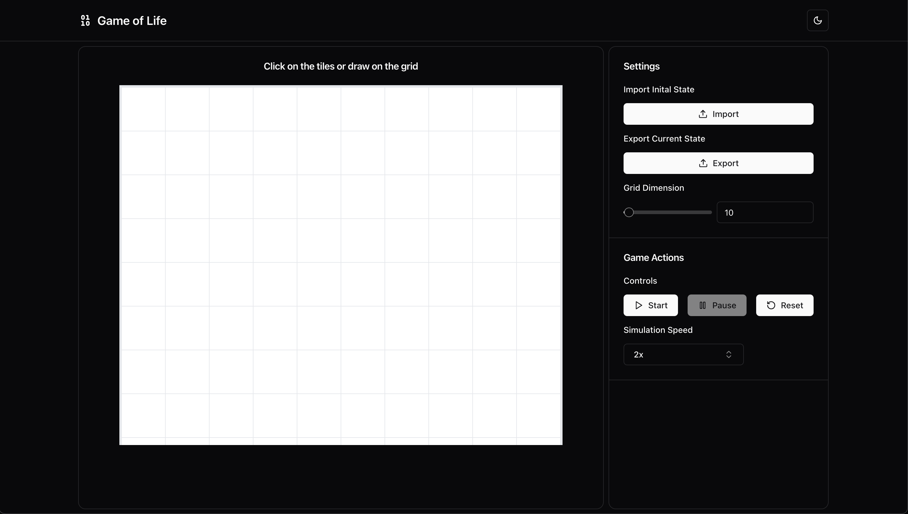

# Game of Life

This project is a React implementation of [Conway's Game of Life](https://en.wikipedia.org/wiki/Conway%27s_Game_of_Life), a cellular automaton simulation devised by mathematician John Conway. The game is a simulation where the observer can see the cells evolve over time based on the initial state of the grid. The game follows rules that allow successive evolutions (states) to be computed.



## 🎮 Live Demo

Video: https://github.com/user-attachments/assets/75bba6ac-0769-4e79-8456-4bc35e0d6a18


## Game Rules

#### Birth:

- A cell that is dead at time step t will be alive at time step t+1 if exactly three of its eight neighbors were alive at time step t.

#### Survival:

- A cell that is alive at time step t will remain alive at time step t+1 if two or three of its neighbors are alive at time step t.

#### Death:

- In all other cases, a cell dies or remains dead. This happens due to overpopulation (more than three live neighbors) or loneliness (fewer than two live neighbors).

#### Grid Boundaries

- All cells beyond the borders of the grid are considered dead.

The logic to adhere to these rules can be found in the `countNeighbors` and the `getNextCellState` methods which work in conjunction.,

## 🚀 Features

- Interactive grid to set initial cell states
- Start, pause, and reset game controls
- Adjust simulation speed
- Adjustable grid size
- Import and export grid states
- Responsive design for various screen sizes with light and dark mode

## 🛠️ Technologies Used

- Vite
- React
- TypeScript
- Tailwind CSS + Shadcn

## 🚦 Getting Started

1. Clone the repository:

```
git clone https://github.com/sakibh/game-of-life.git
```

2. Install dependencies:

```
cd game-of-life npm install
```

3. Start the development server:

```
npm run dev
```

4. Open [http://localhost:5173](http://localhost:5173) to view it in the browser.

## Import Initial Grid State
You can import an initial grid state to test your simulation. The input file needs to be a `JSON` file with a nested array of values (2D array). The values should be `0` (dead) or `1` (alive).

Example:

`grid_data.json`

```
[
  [
    0,
    0,
    0,
    1
  ],
  [
    0,
    1,
    1,
    0
  ],
  [
    0,
    0,
    0,
    0
  ],
  [
    1,
    0,
    0,
    0
  ]
]
```
